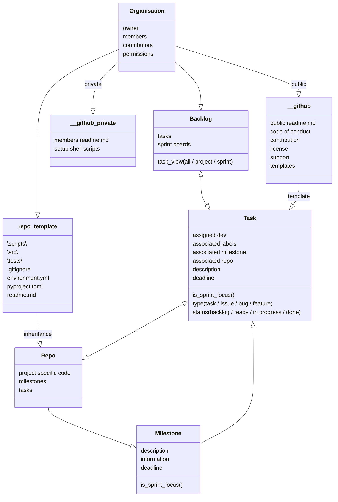

# Contributing to UKPN DSO developments
The Data Science & Development Team aims to produce valuable software and tooling for the DNO. 
This is GitHub organisation that contains the various codebases for all DS&D projects.

## Ways of working
We operate a very distinct process with git on GitHub, which is deployed to our Azure VM.


### GitHub setup
The GitHub organisation operates as follows:
#### Organisation
The organisation contains the [.github](https://github.com/UKPN-DSO/.github), [.github-private[](),](https://github.com/UKPN-DSO/.github-private) and all core reprositories belonging to the team. 
The organisation also gontains the project [Backlog](https://github.com/orgs/UKPN-DSO/projects/1) with all the tasks, where sprints can be managed.

#### Repos
Repositories should follow the [repo template design]().

#### Milestones
Each repo can have milestones. These are long term guiding deliverables or outcomes for the team to achieve. The milestone belongs to a project (hence why it lives in the repo). 

#### Tasks (a.k.a., issues)
Tasks can be bugs, improvements, pipelines, documentation or entirely new features.
A task is associataed to a repo, and should align to a milestone. 
Tasks have many labelling options, and will be asigned `sprint focus` when ready to be completed.
Tasks can be created from within the repo itself, or directly on the [Backlog](https://github.com/orgs/UKPN-DSO/projects/1).
All tasks should be assigned: an owner, a repo, a milestone, and correct labels. They should also have a description.

#### Work flow diagram
The work flow is visualised like so.


  
  


### Project management
Work items can be found in the projects [Backlog](https://github.com/orgs/UKPN-DSO/projects/1). 
All active lines of development should be covered by an open issue. 
Each week, a tasks will be assigned to the sprint, working towards an overall milestone.
Keep track of the work items assigned to you. 

### Git branches
The branch setup is crucial for appropriate collaboration. This is the basis with which all contributors must work on this project. 
If you are new to this project, you will most likely be making a feature branch from the development branch to start playing around.

| Branch name | Purpose | Signed off by | Source branch of PR | Branch cloned from | Deleted on PR |
|--|--|--|--|--|--|
| Production (prod) | The code version in production (or simply just prod) is what Azure uses when executing scheduled tasks. Prod should always be our most rigorous, robust and best effort of perfect uptime. Any issues on prod should be fixed immediately using a hotfix branch. The code on prod should only ever be of the highest calibre with complete documentation. | DevOps lead | Release or hotfix | N/A | Permanent branch |
| Release | Dedicated branch for this release to prod. Here we perform rigorous testing, ensure and update unit tests, documentation and production worthy code (e.g., formatting, docstrings, type hints, etc.). Release is also where versioning changes occur. Release is not a place for making code changes unless necessary, such as new unit tests or errors.| DevOps lead | N/A | Main | Yes |
| Hotfix | For an emergency change required to be made to production. These are when a change simply cannot wait for a feature development and the release pipeline work flow, potentially fixing errors or security risks, or perhaps for a fundamental change in data dependencies. | Senior developers and DevOps lead | N/A | Production | Yes |
| Main | This is the latest version with all completed features. Main should always be working, though bugs at this stage would be dealt with in the development branch with lesser urgency. Main can be considered a staging area. Once a release has been completed, the process will start again taking main in it's current form. Main should have full documentation, docstrings, commentary,  | Senior developers | Development, Release, Hotfix. | N/A | Permanent branch |
| Development (dev) | This is where core developments are made. The dev branch should work; broken code should not be pushed here. However, the barrier for what is _working_ is significantly lower than main. This is where new features are staged for a merge to main. Dev represents the latest in all features. Though these changes cannot make it to production before going through PRs to main, release and then prod. Dev can be directly edited for smaller changes, or branched from for work task features. Once a release or hotfix is completed into PR, it cascades back down to dev. | Developers | Feature and main. | N/A | Permanent branch |
| Feature | A feature branch is for more time consuming developments or developments that present significant change risk. As features must undergo PRs to get into dev, they should be used only if the new developments are disruptive. Feature branches should not really become substantial changes. Small PRs are preferable at this stage for simplicity. | Developers | Development or feature | Yes |


This is the git branch scheme visualised.
```mermaid
%%{init: {'theme': 'base' } }%%
gitGraph
    checkout main
    commit id: "initial"
    commit id: "main setup" tag: "v0.1.0"
    branch develop order: 3
    checkout develop
    commit id: "develop setup"
    commit
    branch small-feature order: 4
    commit id: "feature started"
    checkout develop
    commit id: "general changes"
    checkout small-feature
    commit
    checkout develop
    commit
    branch large-feature order: 5
    commit id: "next feature started"
    commit
    checkout small-feature
    commit
    checkout develop
    commit
    checkout small-feature
    merge develop
    checkout develop
    merge small-feature
    commit
    branch release order: 2
    checkout release
    commit id: "staged for release"
    checkout develop
    commit
    checkout large-feature
    commit
    checkout release
    commit
    checkout main
    merge release tag: "v0.1.0"
    checkout develop
    merge release
    checkout main
    branch hotfix order: 1
    checkout hotfix
    commit
    checkout develop
    commit
    checkout large-feature
    commit
    checkout hotfix
    commit
    checkout main
    merge hotfix tag: "v0.1.1"
    checkout develop
    merge hotfix
    commit
    checkout large-feature
    merge develop
    checkout develop
    merge large-feature
    commit
    checkout release
    merge develop
    commit
    commit
    checkout main
    merge release tag: "v1.0.0"
    checkout develop
    merge release
  ```
  

### Pull requests (merging)
Merging branches with a pull request (PR) is the process of peer review of the code. The level of scruitiny of a PR depends on the branch that is receiving a merge. For example, the PR to go from release to production will have the highest level of scrutiny and require signoff by all senior lead developers and devops. However, the PR from feature to development would require less scrutiny.

To make PRs simple. 
* Do not bundle together many features at once. 
* Keep each PR specific to a single work item if possible. 
* Small changes that are not breaking or disruptive can be built directly on dev in a local branch should the developer have enough skill. Under no circumstance should changes that violate the existing testing be pushed to the remote version of dev. 
* Effort should be made to ensure testing, documentation, format and docstrings are coherent, as this makes life easier when more important PRs (e.g., from release to production).
* A PR is only needed when code is moving from a temporary branch (hotfix, release, feature) into a permanent branch (dev, main, prod). 

Engage in PRs. They are what keep us resiliant. To engage: 
* inspect the code changes
* read the commentary
* ask questions and make comments
* suggest code edits instead of commenting if it would be overall more efficient (that can be accepted by the PR owner)
* git checkout the exact commit and test locally. 

### Versioning
Code versioning assumes the format _vX.Y.Z_

*X* : When the nature of the product significantly changes through new and improved features, functionality, and when dependents would experience a significant change.
*Y* : When a new feature is added but the change is not breaking or substantial. 
*Z* : For bug fixes to production code. 

For example, _v3.12.1_ implies that we are in the 3rd generation of code, with 12 new features and 1 hotfix.


## Team
The project is created and maintained by the following team. 
| Member  | Role  | Core operational forecasting responsibilities | Contact |
|--|--|--|--|
| _Jamie Bright_ | DSO Forecasting Lead  | Project lead, project management, project design, project development, forecasting techniques, data sciecnce, machine learning, validation, statistics, data visualisation. | 07746699927 |
| _Zahin Rahim_ |  Data Scientist \ Developer| Project development, feature design, feature delivery, data quality algorithms, issue detection algorithms.  | 07889733692|
| _Harshil Sumaria_ | Power Systems & Development Engineer | Project development, feature design, feature delivery, PI data interface, asset framework, connectivity insights, DevOps knowledge.| 07908277647|
| _Nilesh Zagade_ |  Data Engineer | Deployment architecture, data pipelines/ETL, logging and error reporting, Azure management, task scheduling, resourcing, project packaging, APIs, computational efficiency.  | |
| _Patrick de Mars_ | Data Scientist | Project development, feature design, feature delivery, machine learning, artificial intelligence, power systems modelling, python power, optimisations, forecasting techniques. | |

## Useful tips
[Markdown compiler](https://stackedit.io/app#)

